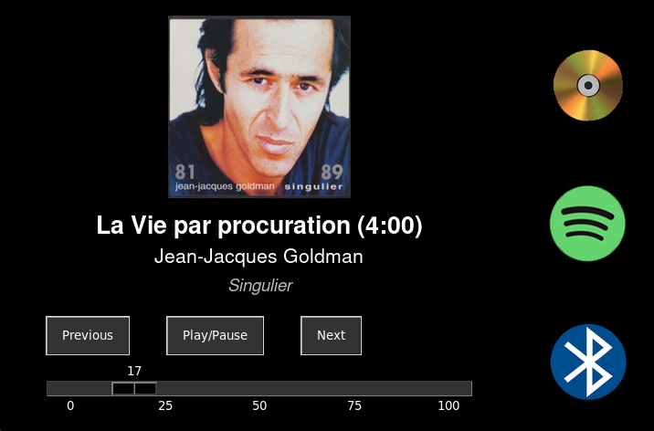

# 🎵 Kiosk - Raspberry Pi Audio Player

Kiosk est une interface audio simplifiée pour Raspberry Pi avec écran tactile. Il permet la lecture de CD, de sources Bluetooth, et l'intégration Spotify, le tout dans une interface sobre et tactile, optimisée pour un affichage en plein écran

## Fonctions :
- 📀 Lecture de CD avec récupération des infos via MusicBrainz
- 📱 Spotify Connect via `spotifyd`
- 🔊 Enceinte Bluetooth avec reconnaissance automatique de morceaux (Shazam)
- 📷 Affichage dynamique de la pochette et des métadonnées

## Prérequis :
- Raspberry Pi avec Raspberry Pi OS Bookworm 32 bits (version 12) 
- Ecran tactile (320x240) - Script d'installation pour le MHS-3.5" inclus 
- Carte son compatible ALSA (ex: IQaudio DAC)
- (Optionnel) Dongle Wifi

# Installation :

1. Préparation

🔍 Télécharge et grave Raspberry Pi OS Bookworm 32 bits sur une carte SD (Wifi-Utilisateur player-SSH)

🔄 Démarre la Raspberry Pi

2. Installer Git

sudo apt update
sudo apt install -y git

3. Cloner ce dépôt

git clone https://github.com/gilbgeo/rpi-music-kiosk Kiosk

4. Lancer l'installation

chmod +x ./Kiosk/install/install.sh
./Kiosk/install/install.sh

Le script te guidera pas à pas pour configurer :

l'écran tactile MHS-3.5" (optionnel)

les composants Bluetooth (dongle, agent, appairage automatique)

Spotifyd (client Spotify en ligne de commande)

l'environnement graphique

Capture d'écran (optionnel)

(Ajouter ici une capture d'écran du Kiosk en fonctionnement)
## Capture d'écran

## Auteur :
Thomas Beeuwsaert — [https://github.com/gilbgeo](https://github.com/gilbgeo)

N'hésite pas à proposer une Pull Request pour améliorer ce projet !
